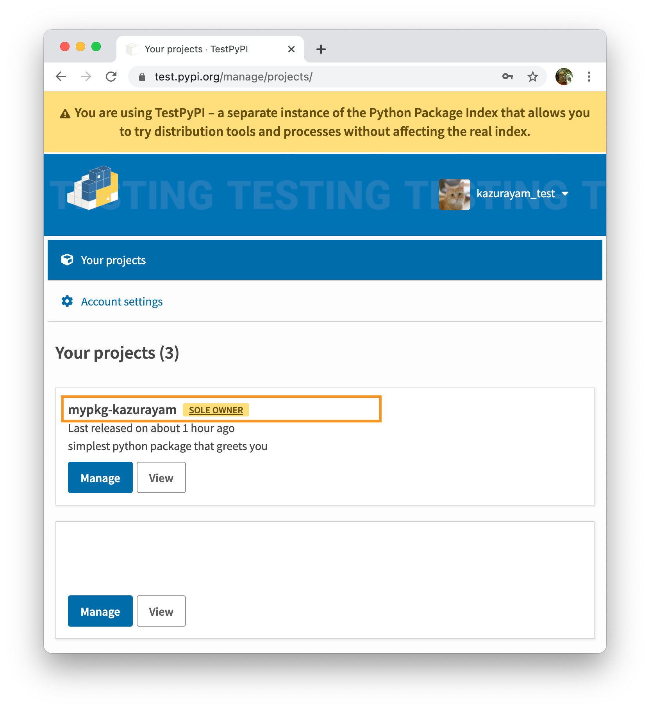
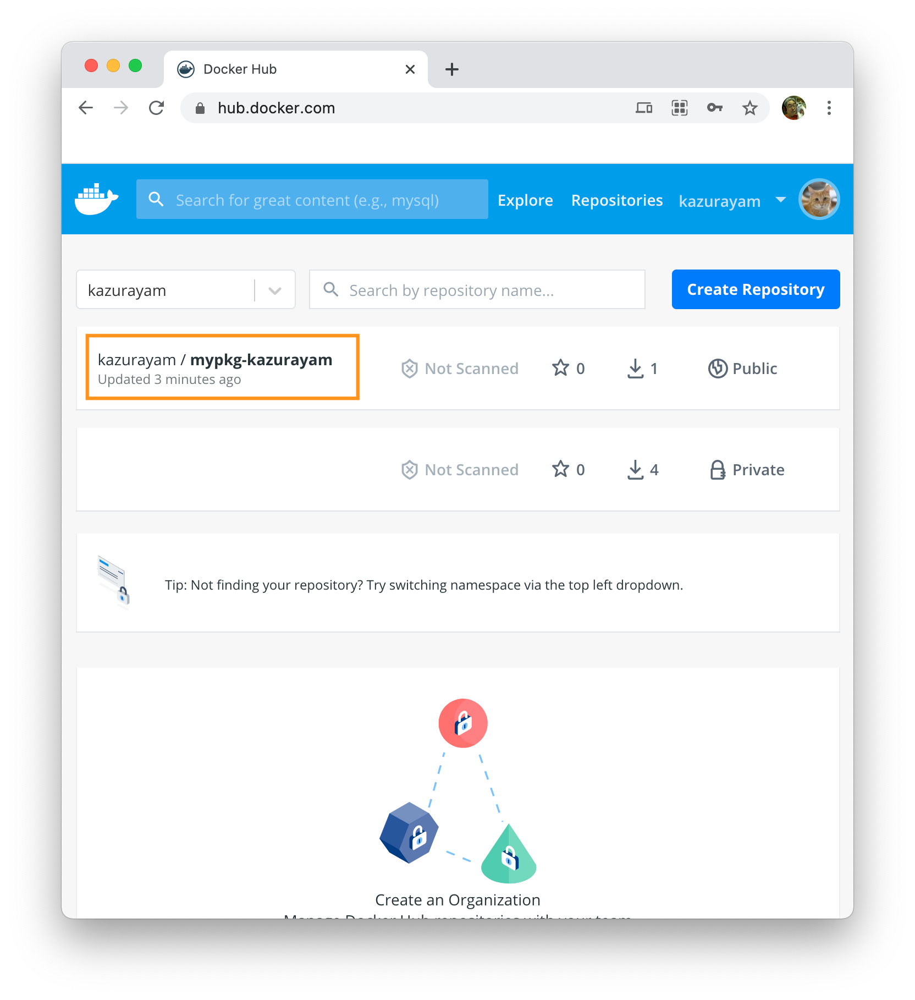

# Pythonプロジェクトのテンプレート　レベル3

- @author kazurayam
- @date Feb 2021

<!-- START doctoc generated TOC please keep comment here to allow auto update -->
<!-- DON'T EDIT THIS SECTION, INSTEAD RE-RUN doctoc TO UPDATE -->
<details>
<summary>Table of Contents</summary>

- [これは何か](#%E3%81%93%E3%82%8C%E3%81%AF%E4%BD%95%E3%81%8B)
- [前提条件](#%E5%89%8D%E6%8F%90%E6%9D%A1%E4%BB%B6)
- [達成目標](#%E9%81%94%E6%88%90%E7%9B%AE%E6%A8%99)
- [手順](#%E6%89%8B%E9%A0%86)
  - [Pipfileから仮想環境を再現する](#pipfile%E3%81%8B%E3%82%89%E4%BB%AE%E6%83%B3%E7%92%B0%E5%A2%83%E3%82%92%E5%86%8D%E7%8F%BE%E3%81%99%E3%82%8B)
  - [コマンドラインで実行可能にしておく](#%E3%82%B3%E3%83%9E%E3%83%B3%E3%83%89%E3%83%A9%E3%82%A4%E3%83%B3%E3%81%A7%E5%AE%9F%E8%A1%8C%E5%8F%AF%E8%83%BD%E3%81%AB%E3%81%97%E3%81%A6%E3%81%8A%E3%81%8F)
  - [pipでライブラリ化する](#pip%E3%81%A7%E3%83%A9%E3%82%A4%E3%83%96%E3%83%A9%E3%83%AA%E5%8C%96%E3%81%99%E3%82%8B)
    - [setup.pyファイルを書く](#setuppy%E3%83%95%E3%82%A1%E3%82%A4%E3%83%AB%E3%82%92%E6%9B%B8%E3%81%8F)
    - [Pipfileからrequirements.txtを生成する](#pipfile%E3%81%8B%E3%82%89requirementstxt%E3%82%92%E7%94%9F%E6%88%90%E3%81%99%E3%82%8B)
    - [MANIFEST.inファイルを作る](#manifestin%E3%83%95%E3%82%A1%E3%82%A4%E3%83%AB%E3%82%92%E4%BD%9C%E3%82%8B)
    - [ライブラリを作る](#%E3%83%A9%E3%82%A4%E3%83%96%E3%83%A9%E3%83%AA%E3%82%92%E4%BD%9C%E3%82%8B)
    - [distディレクトリに作られたtarをpip installしてみる](#dist%E3%83%87%E3%82%A3%E3%83%AC%E3%82%AF%E3%83%88%E3%83%AA%E3%81%AB%E4%BD%9C%E3%82%89%E3%82%8C%E3%81%9Ftar%E3%82%92pip-install%E3%81%97%E3%81%A6%E3%81%BF%E3%82%8B)
  - [PyPIにアップロードする](#pypi%E3%81%AB%E3%82%A2%E3%83%83%E3%83%97%E3%83%AD%E3%83%BC%E3%83%89%E3%81%99%E3%82%8B)
    - [Twineをインストールする](#twine%E3%82%92%E3%82%A4%E3%83%B3%E3%82%B9%E3%83%88%E3%83%BC%E3%83%AB%E3%81%99%E3%82%8B)
    - [PyPIに自分のためのアカウントを作る。](#pypi%E3%81%AB%E8%87%AA%E5%88%86%E3%81%AE%E3%81%9F%E3%82%81%E3%81%AE%E3%82%A2%E3%82%AB%E3%82%A6%E3%83%B3%E3%83%88%E3%82%92%E4%BD%9C%E3%82%8B)
    - [ビルドしてPyPIにアップロードする](#%E3%83%93%E3%83%AB%E3%83%89%E3%81%97%E3%81%A6pypi%E3%81%AB%E3%82%A2%E3%83%83%E3%83%97%E3%83%AD%E3%83%BC%E3%83%89%E3%81%99%E3%82%8B)
  - [Dockerイメージを作る](#docker%E3%82%A4%E3%83%A1%E3%83%BC%E3%82%B8%E3%82%92%E4%BD%9C%E3%82%8B)
    - [Docker Desktop for Macをインストールする](#docker-desktop-for-mac%E3%82%92%E3%82%A4%E3%83%B3%E3%82%B9%E3%83%88%E3%83%BC%E3%83%AB%E3%81%99%E3%82%8B)
    - [Dockeer Hubにアカウントを作る](#dockeer-hub%E3%81%AB%E3%82%A2%E3%82%AB%E3%82%A6%E3%83%B3%E3%83%88%E3%82%92%E4%BD%9C%E3%82%8B)
    - [Dockerイメージを作る](#docker%E3%82%A4%E3%83%A1%E3%83%BC%E3%82%B8%E3%82%92%E4%BD%9C%E3%82%8B-1)
    - [自作したDockerイメージからDockerコンテナを起動する](#%E8%87%AA%E4%BD%9C%E3%81%97%E3%81%9Fdocker%E3%82%A4%E3%83%A1%E3%83%BC%E3%82%B8%E3%81%8B%E3%82%89docker%E3%82%B3%E3%83%B3%E3%83%86%E3%83%8A%E3%82%92%E8%B5%B7%E5%8B%95%E3%81%99%E3%82%8B)
    - [Dockerイメージの保存先](#docker%E3%82%A4%E3%83%A1%E3%83%BC%E3%82%B8%E3%81%AE%E4%BF%9D%E5%AD%98%E5%85%88)
    - [dockerコマンドのレファレンス](#docker%E3%82%B3%E3%83%9E%E3%83%B3%E3%83%89%E3%81%AE%E3%83%AC%E3%83%95%E3%82%A1%E3%83%AC%E3%83%B3%E3%82%B9)
  - [Docker Hubにアップロードする](#docker-hub%E3%81%AB%E3%82%A2%E3%83%83%E3%83%97%E3%83%AD%E3%83%BC%E3%83%89%E3%81%99%E3%82%8B)
    - [ローカルからイメージをpushする方法](#%E3%83%AD%E3%83%BC%E3%82%AB%E3%83%AB%E3%81%8B%E3%82%89%E3%82%A4%E3%83%A1%E3%83%BC%E3%82%B8%E3%82%92push%E3%81%99%E3%82%8B%E6%96%B9%E6%B3%95)
    - [GitHub連携する方法](#github%E9%80%A3%E6%90%BA%E3%81%99%E3%82%8B%E6%96%B9%E6%B3%95)
- [まとめ](#%E3%81%BE%E3%81%A8%E3%82%81)

</details>
<!-- END doctoc generated TOC please keep comment here to allow auto update -->

## これは何か

Python言語でプログラムを自作したい。そのために環境を作り道具を揃えて使えるようにする必要がある。アプリケーションが何であれ環境と道具は概ね同じであり、繰り返し利用しつつ磨き上げていくものだ。Python初心者のわたしがやってきた準備作業を細かく記録しつつレポジトリとして保存しよう。さまざまなPythonプロジェクトの雛形として使えるだろう。

Gitレポジトリを4つ作る。

1. [PythonProjectTemplateLevel1](https://github.com/kazurayam/PythonProjectTemplateLevel1) --- Python処理系をインストールする。pipenvで仮想環境を構築する。わたし流のディレクトリ構造を決める。IntelliJ IDEAを設定する。pytestでユニットテストする。
1. [PythonProjectTemplateLevel2](https://github.com/kazurayam/PythonProjectTemplateLevel2) --- わたしのPythonコードをpipでライブラリにしてPyPIにアップロードして共有可能にする。そのライブラリを仕込んだDockerイメージを作りDocker Hubにアップロードして共有可能にする。
1. [PythonProjectTemplateLevel3](https://github.com/kazurayam/PythonProjectTemplateLevel3) --- つまりこのレポジトリ。Flaskフレームワークを使ってWebサーバアプリケーションを作る。Dockerイメージを作る。
1. [PythonProjectTemplateLevel4](https://github.com/kazurayam/PythonProjectTemplateLevel4) --- Level3で作ったWebサーバアプリのユーザインタフェースをSeleniumでテストする。Page Objectモデルで。

このプロジェクトを最初に作るにあたっては [GitHubのレポジトリテンプレート機能](https://dev.classmethod.jp/articles/github-template-repository/) を利用した。すなわちGitHubのサイトで Level2のレポジトリを Template RepositoryとするようチェックボックスをONした。そしてLevel3のレポジトリをNewするにあたって、Level2のレポジトリをTemplate Repositoryとして指定した。するとLevel2のファイルとディレクトリがコピーされて下書きとして使えるようになっていた。便利ですね。

## 前提条件

1. マシンはMac Book Air、OSは macOS 11.1 Big Sur。
1. MacにHomebrewをインストール済み、説明は省略する
1. MacにGitをインストール済み、Git Hubに自分のアカウントを持っていて、Gitの操作に熟達していると前提するので説明は省略する。
1. MacでIntelliJ IDEAを開発環境として使う。IDEAのライセンスを持っていてPythonプラグインをインストール済みと前提する。

## 達成目標

Level2では下記のことを達成目標とする。

1. Flaskフレームワークの公式サイトにある [Tutorial](https://flask.palletsprojects.com/en/1.1.x/tutorial/#tutorial) を参照しながら、Webアプリケーションを自作する。
1. 自作したWebアプリをpipコマンドでライブラリ化する。PyPIにアップする。
1. PyPIにアップした自作ライブラリを使ってDockerイメージを作成する。DockerイメージをDocker Hubにアップする。 

自作のWebアプリのDockerイメージを作ることができれば、それを使ってどのマシンでもそのWebアプリを起動することが簡単にできるようになる。

## 手順

Python処理系のインストール、ディレクトリ構造の決定、pipenvで仮想環境を作る、IntelliJ IDEAの設定、pytestによるユニットテストの作成と実行 --- これらについては下記のLevel1のREADMEを参照のこと。

- [PythonProjectTemplateLevel1](https://github.com/kazurayam/PythonProjectTemplateLevel1) 


またpipコマンドによるパッケージ化の作業とdockerコマンドによるDockerイメージの操作に関しては下記のLevel2のREADMEを参照のこと。

- [PythonProjectTemplateLevel2](https://github.com/kazurayam/PythonProjectTemplateLevel2)

### Pipfileから仮想環境を再現する

Gitレポジトリから`Pipfile`と`Pipfile.lock`をローカルに取得してると前提する。Pipfile.lockに基づいて仮想環境を再現しよう。

```
$repos/pyproject/ $ pipenv install
Installing dependencies from Pipfile.lock (4e9768)...
  🐍   ▉▉▉▉▉▉▉▉▉▉▉▉▉▉▉▉▉▉▉▉▉▉▉▉▉▉▉▉▉▉▉▉ 0/5 — 0  🐍   ▉▉▉▉▉▉▉▉▉▉▉▉▉▉▉▉▉▉▉▉▉▉▉▉▉▉▉▉▉▉▉▉ 1/5 — 0  🐍   ▉▉▉▉▉▉▉▉▉▉▉▉▉▉▉▉▉▉▉▉▉▉▉▉▉▉▉▉▉▉▉▉ 2/5 — 0  🐍   ▉▉▉▉▉▉▉▉▉▉▉▉▉▉▉▉▉▉▉▉▉▉▉▉▉▉▉▉▉▉▉▉ 3/5 — 0  🐍   ▉▉▉▉▉▉▉▉▉▉▉▉▉▉▉▉▉▉▉▉▉▉▉▉▉▉▉▉▉▉▉▉ 4/5 — 0  🐍   ▉▉▉▉▉▉▉▉▉▉▉▉▉▉▉▉▉▉▉▉▉▉▉▉▉▉▉▉▉▉▉▉ 5/5 — 0  🐍   ▉▉▉▉▉▉▉▉▉▉▉▉▉▉▉▉▉▉▉▉▉▉▉▉▉▉▉▉▉▉▉▉ 5/5 — 00:00:02
To activate this project's virtualenv, run pipenv shell.
Alternatively, run a command inside the virtualenv with pipenv run.
```

これによってこのLevel3プロジェクトのために新しいPython仮想環境が自動的に作られる。

なお新しいPython仮想環境をIntelliJ IDEAの設定に繁栄すべきところがが、自動的に修正されない。手作業で修正せよ。

### Flask Tutorialを写経する

Flaskの公式ドキュメントに含まれるチュートリアルをそのまま写経した。

- [Tutorial](https://flask.palletsprojects.com/en/1.1.x/tutorial/#tutorial) 

これについてわたしか付け加えることなどない。公式ドキュメントを読んでください。

#### flaskをPython仮想環境にインストールする

```
$ cd PythonProjectTemplateLevel3/pyproject (master *)
$ pipenv run pip install flask
```

```
Collecting flask
  Using cached Flask-1.1.2-py2.py3-none-any.whl (94 kB)
Collecting click>=5.1
  Using cached click-7.1.2-py2.py3-none-any.whl (82 kB)
Collecting Jinja2>=2.10.1
  Downloading Jinja2-2.11.3-py2.py3-none-any.whl (125 kB)
     |██▋                             | 10 kB 1.8 MB/s eta 0:     |█████▏                          | 20 kB 1.4 MB/s eta     |███████▉                        | 30 kB 1.3 MB/s e     |██████████▍                     | 40 kB 1.3 MB/     |█████████████                   | 51 kB 1.2 M     |███████████████▋                | 61 kB 1.     |██████████████████▎             | 71 kB     |████████████████████▉           | 81      |███████████████████████▌        |      |██████████████████████████           |████████████████████████████▊     |█████████████████████████████     |████████████████████████████████| 125 kB 1.2 MB/s 
Collecting Werkzeug>=0.15
  Using cached Werkzeug-1.0.1-py2.py3-none-any.whl (298 kB)
Collecting itsdangerous>=0.24
  Using cached itsdangerous-1.1.0-py2.py3-none-any.whl (16 kB)
Collecting MarkupSafe>=0.23
  Using cached MarkupSafe-1.1.1-cp38-cp38-macosx_10_9_x86_64.whl (16 kB)
Installing collected packages: MarkupSafe, Werkzeug, Jinja2, itsdangerous, click, flask
Successfully installed Jinja2-2.11.3 MarkupSafe-1.1.1 Werkzeug-1.0.1 click-7.1.2 flask-1.1.2 itsdangerous-1.1.0
```


#### .flaskenv ファイルに環境変数の設定を書く

Flaskを起動するとに環境変数 `FLASK_APP` ほかを指定しなければならない。コマンドラインでいちいち指定するのは面倒だ。`.flaskenv`ファイルに書けばいいらしい。

- https://www.pgen.info/archives/1691

[.flaskenv](pyproject/.flaskenv) ファイルを書いた。

```
FLASK_APP=src/flaskr
FLASK_ENV=development
```

#### python-dotenvをインストールする

```
$ pipenv run flaskrun
Loading .env environment variables...
 * Tip: There are .env or .flaskenv files present. Do "pip install python-dotenv" to use them.
...
```
python-dotenvをインストールしろと言われた。

```
$ pipenv install python-dotenv
```

#### Pipfileにスクリプトを書いて起動を簡単にする

[Pipfile](pyproject/Pipfile) に `flaskrun` という名前でスクリプトをかた。これでFlaskアプリの起動が簡単になった。すなわちこうだ。

```
$ pipenv run flaskrun
```
すると下記のようなメッセージが表示され、flaskrアプリケーションが立ち上がったのがわかる。ブラウザで http://127.0.0.1:5000/hello を問い合わせると `Hello, World!` と応答した。

```
 * Serving Flask app "src/flaskr" (lazy loading)
 * Environment: development
 * Debug mode: on
 * Running on http://127.0.0.1:5000/ (Press CTRL+C to quit)
 * Restarting with stat
 * Debugger is active!
 * Debugger PIN: 336-613-971
```

#### Courtesy Notice

flaskrが起動されるとき長いメッセージが表示された。

```
Courtesy Notice: Pipenv found itself running within a virtual environment, so it will automatically use that environment, instead of creating its own for any project. You can set PIPENV_IGNORE_VIRTUALENVS=1 to force pipenv to ignore that environment and create its own instead. You can set PIPENV_VERBOSITY=-1 to suppress this warning.
```

これを表示しないようにしたい。メッセージには環境変数 PIPENV_VERBOSITY=-1と設定すればいいとある。

たしかにコマンドラインで
```
$ PIPENV_VERBOSITY=-1
$ pipenv run flaskrun
```
とやればCourtecy Noticeは表示されなくなる。でもキー入力が面倒だ。

どこかファイルにPIPENV_VERBOSITY=-1と書きたいのだがどこに書けばいいのか？setup.pyでもだめ、Pipfileでもだめだった。はてな？

...

なあんだ。こうすればいいんだ。

```

```


### pipでライブラリ化する

#### setup.pyファイルを書く

`$repos/pyproject`ディレクトリの下に [`setup.py`](pyproject/setup.py) ファイルを作った。

#### Pipfileからrequirements.txtを生成する

pipコマンドでライブラリ化するには [`requirements.txt`](pyproject/requirements.txt) ファイルが必要になる。当該ライブラリを実行するときに必要となる外部ライブラリの名前とバージョンを列挙したファイルである。

下記のコマンドで生成する。

```
$ cd $repo/pyproject
$ pipenv run pip freeze > requirements.txt
```

このテクニックを使えば外部依存ライブラリの管理をPipenvに一元化しつつ、pipコマンドでライブラリ化する作業をすることができます。

#### MANIFEST.inファイルを作る

tarファイルを作るために `python setup.py sdist` コマンドを実行するとき `requirements.txt` ファイルを読み込ませる必要がある。そのために MANIFEST.in を新規作成しておく。

[pyproject/MANIFEST.in](pyproject/MANIFEST.in)

#### ライブラリを作る

```
:~/github/PythonProjectTemplateLevel2/pyproject (master *+)
$ pipenv run python setup.py sdist
```
とやる。するといろいろファイルができる。

```
$ tree .
.
└── pyproject
    ├── MANIFEST.in
    ├── Pipfile
    ├── Pipfile.lock
    ├── dist
    │   └── mypkg-1.0.tar.gz
    ├── mypkg.egg-info
    │   ├── PKG-INFO
    │   ├── SOURCES.txt
    │   ├── dependency_links.txt
    │   ├── entry_points.txt
    │   ├── requires.txt
    │   └── top_level.txt
    ├── requirements.txt
    ├── setup.py
    ├── src
    │   └── mypkg
    │       ├── __init__.py
    │       └── greeting.py
    └── tests
        ├── __init__.py
        ├── conftest.py
        └── test_greeting.py
```

`dist/mypkg-1.0.tar.gz` がPyPIにアップロードされるべきライブラリの実体だ。

#### distディレクトリに作られたtarをpip installしてみる

distディレクトリに作られたtarファイルをPyPIにアップロードする前に、ローカルにpip install してみよう。

```
$repos/pyproject (master *+)
$ pipenv run pip install dist/mypkg-1.0.tar.gz
```

コマンドラインで実行してみよう。

```
$ pipenv run greeting
Hello, World!
```

greetingは引数を1個受けとることができる。

```
$ pipenv run greeting Simon
Hello, Simon!
```

### PyPIにアップロードする

The Python Package Index略してPyPIに自作ライブラリをアップロードすれば、別マシンでそれを pip install xxxxx で簡単にインストールして利用することができます。やりましょう。

#### Twineをインストールする

Twineというツールを使ってPyPIにアップロードします。下記の記事を参考にインストールしよう。

- [Python: Twine を使って PyPI にパッケージをアップロードする](https://blog.amedama.jp/entry/2017/12/31/175036)

```
$repos/pyproject (master *)
$ pipenv run pip install twine
```

#### PyPIに自分のためのアカウントを作る。

本番リリース用のサイト https://pypi.org/ の Register 画面で自分のアカウントを作ろう。

同じくテスト用のサイト https://test.pypi.org/ の Register 画面で自分のアカウントを作ろう。

UsernameとPasswordをメモっておけ。

[`~/.pypirc`](https://packaging.python.org/specifications/pypirc/) ファイルを作る。そこには本番リリース用PyPIのURLとわたしのアカウントに関する情報、テスト用TestPyPIのURLとわたしのアカウントに関する情報を書いておく。これによってtwineコマンドを実行するときにURLやアカウント情報を繰り返し入力する手間を省くことができる。当然ながら~/.pypircファイルを他人の目に晒さないように注意せよ。

#### ビルドしてPyPIにアップロードする

ビルドしてテスト用のPiPIにアップロードしてみよう。

```
$repos/pyproject/ $ pipenv run python setup.py sdist

...

$ pipenv run twine upload --repository pypitest dist/*
Uploading distributions to https://test.pypi.org/legacy/
Uploading mypkg-1.0.tar.gz
100%|█████████████████████████████████████]100%|██████████████████████████████████████| 4.13k/4.13k [00:01<00:00, 2.72kB/s]
NOTE: Try --verbose to see response content.
HTTPError: 403 Forbidden from https://test.pypi.org/legacy/
The user 'kazurayam_test' isn't allowed to upload to project 'mypkg'. See https://test.pypi.org/help/#project-name for more information.
```

あれ？エラーが発生した。メッセージに https://test.pypi.org/help/#project-name を読めと書いてある。どうやら `mypkg-1.0.tar.gz` というファイル名の先頭部分 `mypkg` という名前がPyPIのお気に召さないらしい。[Why cant I upload my own package to PyPI when my credential are working?
](https://stackoverflow.com/questions/57457879/why-cant-i-upload-my-own-package-to-pypi-when-my-credential-are-working)によれば原因はPyPIのどこかにすでに `mypkg` という名前のライブラリがすでに存在しているから。だからユニークな名前に変更せよ、という。

では対処しよう。今まで `setup.py` にこう書いてあった。
```
setup(
    name="mypkg",
```
ここを書きかえよう。
```
setup(
    name="mypkg-kazurayam",
```
そして `python setup.py sdist` と `twine upload --repository pypitest dist/*` をやり直せ。今度はどうかな？

```
$ pipenv run python setup.py sdist
```

ここで気がついた。旧い名前の成果物 `pyproject/dist/mypkg-1.0.tar.gz` が自動では削除されずに残っていた。これを手動で削除しなければならなかった。

```
$ pipenv run twine upload --repository pypitest dist/*
Uploading distributions to https://test.pypi.org/legacy/
Uploading mypkg-kazurayam-1.0.tar.gz
100%|██████████████████████████████████████████████████████████████]100%|████████████████████████████████████████████████████████████████████████████████████████| 4.19k/4.19k [00:02<00:00, 2.07kB/s]

View at:
https://test.pypi.org/project/mypkg-kazurayam/1.0/
```

うまくいった。ブラウザで https://test.pypi.org/project/mypkg-kazurayam/1.0/ を開いたらPyPIにアップロードできていた。



成功！

### Dockerイメージを作る

#### Docker Desktop for Macをインストールする

maxOS 11.1に Docker Desktop for Mac をインストールして使うことにする。

Docker Desktop for Macを使えば、Mac Book Air上でDockerコンテナを動かすことができる。コマンドラインで `docker` コマンドを実行することができる。

https://docs.docker.com/docker-for-mac/install/ を参照しながらインストールせよ。Docker Hubからdmgファイルをダウンロードしてダブルクリックし、Applicationsディレクトリに格納するだけだ。


#### Dockeer Hubにアカウントを作る

私は [Docker Hub](https://hub.docker.com/) に自分のためのアカウントを作成済みだった。まだ持っていなければ作ればいいだけのこと。

#### Dockerイメージを作る

[pyproject/Dockerfile](pyproject/Dockerfile) を作った。ここにはDockerイメージをを作るのに必要なDockerコマンドを記述しておく。

そしてdockerコマンドを実行する。

```
$repos/pyproject (master *+)
$ docker build --tag kazurayam/mypkg-kazurayam:1.0 .

...

Successfully built 2aee34772e1a
Successfully tagged kazurayam/mypkg-kazurayam:1.0
```
成功した。Dockerイメージができたことを確認するには `docker list` コマンドを投入する。

```
$ docker image ls
REPOSITORY                       TAG          IMAGE ID       CREATED         SIZE
kazurayam/mypkg-kazurayam        1.0          2aee34772e1a   3 minutes ago   136MB

...
```

#### 自作したDockerイメージからDockerコンテナを起動する

私のMac上の別の適当なディレクトリにcdしてからdocker runコマンドを実行すればそこでDockerコンテナを起動することができる。やってみよう。Dockerコンテナが起動され、そのbashシェルにログインした状態になる。

```
$ cd ~/tmp
$ docker run -it --rm kazurayam/mypkg-kazurayam:1.0
root@5c580d014ccf:/work# 
```

できた。ではPythonで自作した `greeting` コマンドを実行してみよう。

```
root@5c580d014ccf:/work# greeting Python
Hello, Python!
root@5c580d014ccf:/work# 
```

greetingコマンドが動いた。

どんなdockerコンテナが今動いているかを見るには、別のターミナルを起動して、docker psコマンドを打つ。

```
$ docker ps
CONTAINER ID   IMAGE                           COMMAND             CREATED          STATUS          PORTS     NAMES
d036761d3325   kazurayam/mypkg-kazurayam:1.0   "/bin/sh -c bash"   12 seconds ago   Up 10 seconds             unruffled_chaplygin
```

ではDockerコンテナを終了させよう。exitすれば良い。

```
root@5c580d014ccf:/work# exit
exit
:~/tmp
```

#### Dockerイメージの保存先

このDockerイメージの実体としてのファイルがPC/Macのどこに保存されたかはdockerコマンドが知っている。Dockerイメージを取り出すには必ずdockerコマンドを使うので、保存場所を知っておく必要はない。

ここで作ったDockerイメージをよそでも利用したければ、イメージをいったんDocker Hubにあげて共有可能な状態にせよ。別PCでdockerコマンドを実行しDocker Hubからイメージをダウンロードせよ。

#### dockerコマンドのレファレンス

dockerコンテナの作成、起動から停止までどんなコマンドを使うかについては

- [Dockerコンテナの作成、起動〜停止まで](https://qiita.com/kooohei/items/0e788a2ce8c30f9dba53)

が役に立つ。

### Docker Hubにアップロードする

自作したDockerイメージをDocker Hubにアップする手順については下記を参考にした。

- [DockerImageをDockerHubに登録する方法](https://qiita.com/kon_yu/items/7c40f4dfbd1cce006ce7)

事前にDocker Hubに自分のためのアカウントを準備しておいた。

#### ローカルからイメージをpushする方法

Docker Hubにログインする
'''
$ docker login
'''

自作したイメージをpushする
```
$ docker push kazurayam/mypkg-kazurayam:1.0
The push refers to repository [docker.io/kazurayam/mypkg-kazurayam]
eabc49849837: Pushed 
02431f26c7f4: Pushed 
a19bcd8712ef: Pushed 
b475be986c39: Pushed 
424db1bab221: Pushed 
d101a5002485: Pushed 
bb52f2ddc560: Pushed 
f001ccd77806: Pushed 
24284177bf76: Mounted from library/python 
b64b3bf8eaca: Mounted from library/python 
ba441d17b790: Mounted from library/python 
477e7db04777: Mounted from library/python 
cb42413394c4: Mounted from library/python 
1.0: digest: sha256:7f297987f71f28d6f1ad3cf839ac355118a59e623dece42b55a3dc15a5ee2774 size: 3033
:~
```

できた。ブラウザで https://hub.docker.com/ を開き、自分のアカウントでログインすれば、今アップしたDockerイメージがたしかにDocker Hubに格納されているのがわかる。



#### GitHub連携する方法

自作プロジェクトを更新してレポジトリをGitHubにpushしたとき、その変更をトリガーとして自動的にDocker Hub上のイメージをビルドし直すことができるらしい。それは便利だ。

ただしこのPythonProjectTemplateLevel2のPythonプログラムはこれ以上ないほどシンプルなのでGitHubとDockerHubを連携させる必要などない。この連携は別の機会に試すことにする。

## まとめ

以上でLevel2は完了。つまり

1. 自作のPythonプログラムをpipでライブラリ化した。自作ライブラリをPyPIにアップした。
1. 自作ライブラリを使ってDockerイメージを作った。DockerイメージをDocker Hubにアップした。

これで自作したPythonプログラムを他のひと他の場所で共有する準備ができた。
